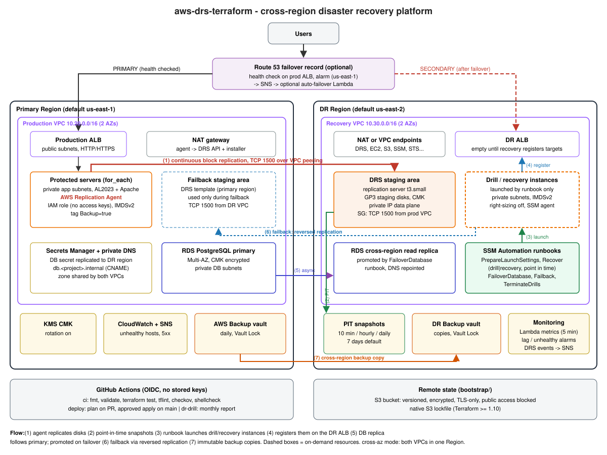

# aws-drs-terraform

**Production-style disaster recovery on AWS, fully as code.** Terraform modules, SSM Automation runbooks, monitoring, tests and CI/CD that protect EC2 workloads and a PostgreSQL database with **AWS Elastic Disaster Recovery (DRS)**, and recover them in another Region (or another AZ) in minutes, with seconds of data loss.



---

## What this project is

Most DRS tutorials stop at "click *Initiate recovery* in the console". This repository turns that demo into a platform you could hand to an auditor:

- **Everything is reproducible.** Networks, IAM, encryption, DRS replication settings, load balancers, database, backups, alarms and DNS are Terraform. Operational actions (drill, recovery, DB failover, failback) are versioned **SSM Automation runbooks** with the Terraform values baked in as defaults.
- **Recovery is one command.** `make drill` runs a non-disruptive test end to end and writes a report. `make failover` performs a real recovery, registers the new instances behind the DR load balancer and promotes the database. With a Route 53 zone, traffic moves automatically.
- **Data survives ransomware.** Point-in-time DRS snapshots (7 days by default) let you recover to a moment *before* an attack. AWS Backup copies to the DR Region into a **Vault Lock** vault that nobody can purge early.
- **It is tested and linted.** `terraform test` (mocked providers, runs offline), tflint, checkov and shellcheck run on every pull request. A scheduled GitHub Actions workflow runs a real drill every month and archives the report as audit evidence.

### Scenario

An online shop runs Apache web servers on EC2 and a PostgreSQL database in **us-east-1**. The business requires:

| Requirement | How it is met |
|---|---|
| Survive loss of an AZ **or** a whole Region | `dr_mode = "cross-region"` (default) or `"cross-az"` |
| RPO of seconds for servers | DRS continuous block-level replication |
| Roll back before ransomware / human error | PIT snapshots: every 10 min (1 h), hourly (24 h), daily (7+ days) |
| RTO of minutes, no idle duplicate fleet | Only a small replication server runs 24/7; recovery instances are launched on demand |
| Users must be redirected automatically | Route 53 failover record + health check on the production ALB |
| Database protected too | RDS Multi-AZ + cross-region read replica + scripted promotion and DNS repoint |
| Proven, auditable DR plan | Monthly automated drill with a Markdown report (measured RTO) |
| No long-lived credentials | Instance roles for the agent, OIDC for CI |

## Features by area

| Area | What you get | Where |
|---|---|---|
| Topology | Two VPCs (prod + DR) with public/app/db/staging subnets, VPC peering, private replication | `modules/network`, `network.tf` |
| Replication | DRS init, replication template (CMK, GP3, private IP, PIT policy), failback template in the primary Region | `modules/drs-replication`, `drs.tf` |
| Workloads | Any number of protected servers via `protected_servers` map; agent auto-installed | `modules/protected-server`, `compute.tf` |
| Traffic | Production ALB, DR ALB, optional HTTPS, Route 53 failover | `modules/web-alb`, `modules/failover-dns` |
| Database | RDS PostgreSQL, replicated secret, private DNS that follows failover | `modules/database` |
| Automation | Prepare, Recover, FailoverDatabase, Failback, TerminateDrills runbooks; optional auto-recovery Lambda | `modules/dr-automation`, `modules/failover-dns` |
| Monitoring | Replication lag/health metrics, alarms, DRS events, ALB alarms, SNS email | `modules/monitoring` |
| Ransomware | CMKs, 7-day PIT, AWS Backup with Vault Lock and cross-region copy | `modules/kms-key`, `modules/backup` |
| Quality | Unit tests, tflint, checkov, shellcheck, pre-commit, Makefile | `tests/`, `.github/workflows/` |
| Delivery | S3 remote state with native locking, GitHub OIDC role, plan/apply pipeline, monthly drill | `bootstrap/`, `.github/workflows/` |

## Quick start

Prerequisites: Terraform >= 1.10, AWS CLI v2, `jq`, an AWS account with admin rights, Regions that support DRS.

```bash
# 1. one-time: state bucket (+ optional GitHub OIDC role)
cd bootstrap
terraform init && terraform apply -var state_bucket_name=<unique-name> -var github_repository=<owner/repo>
cd ..
cp backend.hcl.example backend.hcl        # set the bucket name

# 2. offline checks
make test lint

# 3. deploy (~25 min, mostly RDS and the cross-region replica)
make init
make plan VAR_FILE=envs/lab.tfvars
make apply

# 4. wait for replication (initial sync of an 8 GiB disk: ~15-30 min)
make status          # all servers CONTINUOUS?

# 5. prove it works
make drill           # non-disruptive; report in reports/
```

Real failover, failback and teardown are in [docs/RUNBOOK.md](docs/RUNBOOK.md). **Always run `./scripts/cleanup-drs.sh` before `terraform destroy`.**

## Key configuration

| Variable | Default | Meaning |
|---|---|---|
| `dr_mode` | `cross-region` | or `cross-az` (cheaper, same Region) |
| `primary_region` / `dr_region` | `us-east-1` / `us-east-2` | both must support DRS |
| `protected_servers` | `{ web-1 = {} }` | map of servers to protect (type, AZ, disk) |
| `snapshot_retention_days` | `7` | daily PIT retention |
| `dr_enable_nat_gateway` / `dr_enable_vpc_endpoints` | `true` / `false` | DR VPC egress model |
| `enable_database` | `true` | RDS + replica + DB runbook |
| `backup_vault_lock_mode` | `governance` | `compliance` is irreversible after the grace period |
| `hosted_zone_id` / `dns_record_name` | `null` | enable Route 53 failover |
| `auto_recovery_enabled` | `false` | start runbooks automatically on health-check alarm |
| `alert_emails` | `[]` | SNS email subscribers |

Full list: `variables.tf`. Examples: `envs/lab.tfvars`, `envs/production.tfvars.example`.

## Documentation

| Document | Content |
|---|---|
| [docs/ARCHITECTURE.md](docs/ARCHITECTURE.md) | Components, data flows, RPO/RTO, design decisions |
| [docs/RUNBOOK.md](docs/RUNBOOK.md) | Deploy, drill, failover, DB failover, failback, teardown, troubleshooting |
| [docs/TESTING.md](docs/TESTING.md) | Test pyramid and first-deployment acceptance checklist |
| [docs/CICD.md](docs/CICD.md) | Pipelines, OIDC, remote state |
| [docs/SECURITY.md](docs/SECURITY.md) | Encryption, IAM, ransomware controls, accepted risks |
| [docs/COSTS.md](docs/COSTS.md) | Cost drivers and how to cut them |
| [CHANGELOG.md](CHANGELOG.md) | v1 demo -> v2 platform |

## Repository layout

```
.
├── *.tf                       root composition (primary + DR + global providers)
├── modules/
│   ├── network/               VPC, subnets, NAT, endpoints, flow logs
│   ├── kms-key/               customer-managed keys
│   ├── drs-replication/       DRS init + replication template + replication SG
│   ├── protected-server/      EC2 + Apache + replication agent
│   ├── web-alb/               ALB, target group, listeners
│   ├── database/              RDS primary, DR replica, secret, private DNS
│   ├── backup/                AWS Backup vaults, Vault Lock, plan, DR copy
│   ├── dr-automation/         SSM runbooks + Python handlers + IAM
│   ├── monitoring/            metrics Lambda, alarms, EventBridge, SNS
│   └── failover-dns/          Route 53 failover, alarm, auto-failover Lambda
├── scripts/                   status, drill-test, failover, failback, cleanup
├── tests/                     terraform test (mocked providers)
├── bootstrap/                 state bucket + GitHub OIDC role
├── envs/                      tfvars examples
├── docs/                      documentation + diagram
└── .github/workflows/         ci, deploy, dr-drill
```

## Limits and honest caveats

- The project costs roughly **USD 200-260/month** while running with defaults (two NAT gateways, two ALBs, RDS with replica). Destroy it after experiments. See [docs/COSTS.md](docs/COSTS.md).
- DRS initialization and per-server launch settings have no native Terraform resources; they are handled by the AWS CLI (`local-exec`) and the `PrepareLaunchSettings` runbook.
- Resources DRS creates itself (replication/conversion servers, staging disks, snapshots, recovery instances) are not in Terraform state.
- Database failover is one-way: after promotion, re-establish replication in the opposite direction before failing back (runbook explains).
- Auto-recovery is off by default on purpose: a false positive would launch a second production. Keep a human in the loop until drills are routine.

## License

MIT
