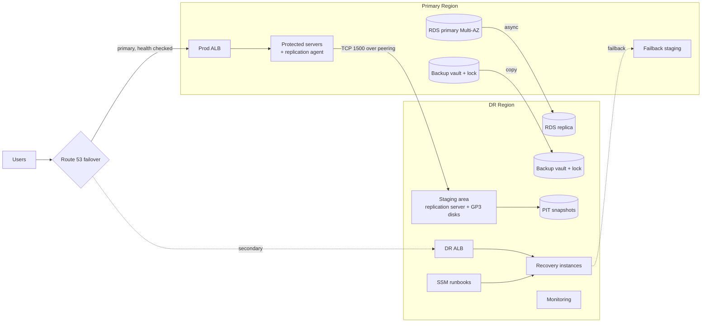

# Architecture

## 1. Overview

The platform has three layers:

1. **Protection (always on).** Replication agents stream disk changes from production servers to a small staging area in the DR Region. The RDS primary streams to a cross-region read replica. AWS Backup copies daily recovery points to a locked vault in the DR Region.
2. **Recovery (on demand).** SSM Automation runbooks launch recovery instances from any point in time, register them on the DR load balancer, promote the database and repoint its DNS name.
3. **Control and evidence.** Route 53 decides where users go, CloudWatch/EventBridge watch replication, and GitHub Actions tests, deploys and drills.

## 2. Components

### Networking (`modules/network`, `network.tf`)
Each Region has a VPC with two AZs and four tiers: **public** (ALB, NAT), **app** (servers, recovery instances, interface endpoints), **db**, and **staging** (DRS replication servers). The VPCs are peered, and private route tables route each other's CIDR through the peering. The default security group is emptied and flow logs go to CloudWatch Logs.

The DR VPC reaches AWS APIs either through a NAT gateway (default, cheaper) or through VPC endpoints for DRS, EC2, STS, SSM, Secrets Manager and Logs plus an S3 gateway endpoint (production option, no internet path).

### Replication (`modules/drs-replication`)
DRS is initialized per Region through the AWS CLI. The replication template uses:

- **`data_plane_routing = PRIVATE_IP`**, so data never crosses the internet.
- A **custom security group** that accepts only TCP 1500, and only from the other VPC.
- **GP3 staging disks encrypted with a CMK.**
- A **PIT policy** of 10-minute snapshots kept 1 h, hourly kept 24 h, and daily kept `snapshot_retention_days`.

A second template in the primary Region hosts the **failback staging area**. It is used only when replication runs in reverse.

### Protected servers (`modules/protected-server`)
These are Amazon Linux 2023 instances in private subnets behind the production ALB. User data installs Apache and the AWS Replication Agent, and the agent authenticates with the instance role (`AWSElasticDisasterRecoveryEc2InstancePolicy`), not with access keys. Add servers by adding entries to `protected_servers`.

### Recovery automation (`modules/dr-automation`)
| Runbook | Steps |
|---|---|
| `<name>-PrepareLaunchSettings` | Finds each server's DRS source server, then sets: no private-IP copy, copy tags, right-sizing NONE, instance type, private subnet (round-robin), recovery SG, recovery instance profile, IMDSv2 |
| `<name>-Recover` | Prepare, then start the job (drill or recovery, latest or `PointInTime`), wait for the job, check the launch status, and for recovery register the instances on the DR target group |
| `<name>-FailoverDatabase` | Promote the replica, wait until it is `available`, then UPSERT `db.<project>.internal` to the replica endpoint |
| `<name>-Failback` | Start reversed replication for all non-drill recovery instances |
| `<name>-TerminateDrills` | Terminate drill instances |

The Python handlers are in `modules/dr-automation/scripts/drs_runbook.py`. Long waits use `aws:waitForAwsResourceProperty`, so no script step hits the 600-second limit.

The recovery instance role carries `AWSElasticDisasterRecoveryRecoveryInstancePolicy`, which reversed replication needs, plus SSM access and read access to the replicated DB secret.

### Traffic (`modules/web-alb`, `modules/failover-dns`)
Each Region has an ALB. The DR ALB's target group stays empty until the Recover runbook registers instances. When a hosted zone is supplied, Route 53 serves a PRIMARY alias to the production ALB, backed by an HTTP(S) health check on `/health.html`, and a SECONDARY alias to the DR ALB.

A CloudWatch alarm on the health check (in us-east-1) notifies SNS. When `auto_recovery_enabled = true`, a Lambda subscribed to that topic starts the Recover (Mode=recovery) and FailoverDatabase runbooks, and never starts a second execution while one is already running.

### Database (`modules/database`)
The primary is RDS PostgreSQL, Multi-AZ, encrypted with the primary CMK, with IAM authentication enabled and logs exported. The replica is a cross-region read replica encrypted with the DR CMK; in `cross-az` mode it is a same-Region replica.

Applications connect to `db.<project>.internal`. This is a CNAME in a private hosted zone associated with both VPCs, so after promotion only the DNS record changes. Credentials live in Secrets Manager with a replica in the DR Region. Terraform ignores later changes to the replica's source and to the DNS record, so a failover performed by the runbook is not undone by the next `apply`.

### Backup and ransomware protection (`modules/backup`, `modules/kms-key`)
Both Regions have a customer-managed key with rotation enabled. The policy allows use only through EC2, RDS, Backup and Secrets Manager, and only by principals in the account. AWS Backup takes a daily backup of everything tagged `Backup=true` and copies it to the DR vault. Both vaults have **Vault Lock**: governance mode by default, compliance mode optional.

### Monitoring (`modules/monitoring`)
A Lambda runs every 5 minutes and publishes `ProtectedServers`, `UnhealthyServers`, `MaxReplicationLagSeconds` and per-server `ReplicationLagSeconds` to the `DRS/<project>` namespace.

Alarms fire on unhealthy servers and on lag above `max_replication_lag_seconds`. Missing data counts as breaching, so a broken monitor also pages. EventBridge forwards DRS "replication stalled" and "launch result" events to SNS, and the primary Region has alarms for unhealthy ALB targets and 5xx responses.

## 3. Recovery objectives

| Tier | RPO | RTO (typical, measure with drills) |
|---|---|---|
| Web servers (latest point) | seconds | ~10-20 min: conversion + boot + target health |
| Web servers (earlier point) | back to the chosen snapshot | same |
| Database | seconds (async replica lag) | ~5-15 min for promotion |
| Backups (last resort) | up to 24 h | hours: restore from vault |

The drill report records the RTO actually measured in your account.

## 4. Design decisions

| Decision | Why | Trade-off |
|---|---|---|
| Cross-region by default | Region outages are the scenario auditors ask about | Higher cost than cross-az; cross-region data transfer |
| Private data plane over peering | No replication over the internet | Peering + NAT cost; CIDRs must not overlap |
| SSM Automation instead of shell scripts | Runs inside AWS, IAM-scoped, audited in CloudTrail, callable from Lambda/console/CLI | Harder to debug than a script |
| Runbooks read Terraform outputs as defaults | One command with no copy-pasted IDs | Re-apply Terraform after adding servers |
| Right-sizing NONE | DRS "basic" sizing can pick large, expensive types | You own the sizing choice |
| DB DNS indirection | Apps never need a config change during failover | 30 s TTL; clients must honor DNS |
| Auto-recovery opt-in | A health-check false positive must not launch a second production | Adds manual minutes to RTO when disabled |
| DR ALB always running | DNS target is always valid; zero-touch failover | ~USD 16/month |
