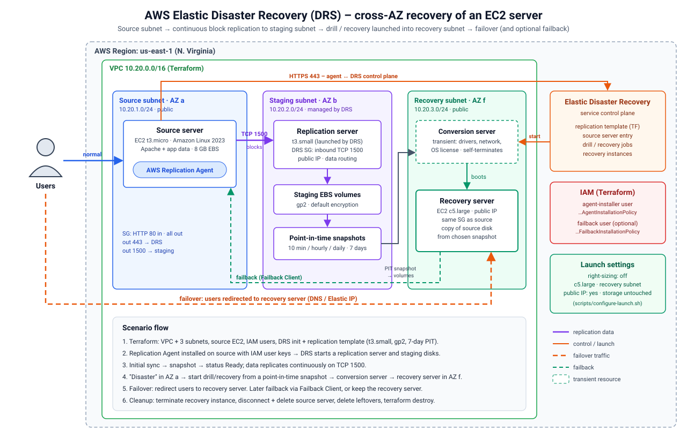

# AWS Elastic Disaster Recovery (DRS) – Terraform lab

This project rebuilds, as code, the disaster-recovery scenario demonstrated in the
"AWS Elastic Disaster Recovery" video: one EC2 server is protected with DRS,
replicated continuously into a staging subnet in another Availability Zone, and
recovered into a third subnet/AZ when a "disaster" hits the original subnet.



## 1. The scenario in short

An application runs on a single EC2 **source server** in a source subnet (AZ a) and
all users hit it. DRS is configured so that an agent on that server streams every
disk write to a **replication server** in a separate **staging subnet** (AZ b),
which keeps low-cost staging EBS volumes and takes **point-in-time snapshots**
(kept for 7 days). When the source subnet goes down, an operator starts a
**drill or recovery** job from a chosen snapshot. DRS spins up a temporary
**conversion server** (fixes drivers, networking and OS licensing so the disk boots
natively on EC2), which then launches the **recovery server** (c5.large) in the
**recovery subnet** (AZ f). Redirecting users to that server is the **failover**.
Moving users and data back to the original (or a new) source afterwards is the
**failback**, which requires the DRS Failback Client and a second IAM user. The
video stops after failover and then cleans everything up to avoid charges.

All three subnets are in the same VPC and region (us-east-1), so this is a
**cross-AZ** recovery design. The video notes that DRS can also replicate to
another VPC or region, but that failback across regions was not possible at the
time it was recorded. (DRS has since added reversed replication for some AWS-to-AWS
cases – check the current AWS documentation before relying on either statement.)

## 2. Terminology

| Term | Meaning in this lab |
|---|---|
| Source server | The EC2 instance being protected; runs the AWS Replication Agent. |
| Replication server | EC2 instance DRS launches in the staging subnet; receives replicated blocks on TCP 1500. |
| Staging area | Staging subnet + replication servers + staging EBS volumes + snapshots. |
| Conversion server | Short-lived instance DRS uses during launch to make the disk bootable on EC2; terminates itself. |
| Recovery server | The instance launched in the recovery subnet from a point-in-time snapshot. |
| Drill | Test launch; the source keeps replicating. |
| Recovery | Launch for a real event (the video uses this). |
| Failover | Sending user traffic to the recovery server. |
| Failback | Replicating data back and returning traffic to a source server. |

## 3. What Terraform manages vs. what DRS manages

Terraform creates the landing zone and settings; DRS creates its own compute and
storage at run time.

| Created by Terraform | Created by DRS at run time |
|---|---|
| VPC, IGW, route table, three subnets (source / staging / recovery) | Replication server(s) and their security group (TCP 1500) |
| Application security group (HTTP 80, optional SSH, all egress) | Staging EBS volumes and point-in-time snapshots |
| Source EC2 instance (Amazon Linux 2023, Apache demo page, SSM role) | Source server record, launch template for the source server |
| IAM user + key with `AWSElasticDisasterRecoveryAgentInstallationPolicy` | Conversion server |
| Optional IAM user with `AWSElasticDisasterRecoveryFailbackInstallationPolicy` | Recovery instance |
| `aws drs initialize-service` (via local-exec) | |
| `aws_drs_replication_configuration_template` | |

Launch settings are per source server and only exist after the agent registers,
so they are applied by `scripts/configure-launch.sh` rather than Terraform.

## 4. Mapping of the video's console settings to this project

| Video setting | Where it lives | Value |
|---|---|---|
| Region | `var.region` | us-east-1 |
| Source subnet | `aws_subnet.this["source"]` | AZ a |
| Staging subnet | `staging_area_subnet_id` | AZ b |
| Replication server instance type | `replication_server_instance_type` | t3.small |
| Staging volume type | `default_large_staging_disk_type` | GP2 (cheaper than GP3) |
| EBS encryption | `ebs_encryption` | DEFAULT |
| Auto-create replication security group | `associate_default_security_group` | true |
| Data routing | `data_plane_routing` / `create_public_ip` | public IP (private IP optional for VPN/DX) |
| Bandwidth throttling | `bandwidth_throttling` | 0 (no cap) |
| Snapshot retention | `pit_policy` rule 3 | 7 days |
| Right-sizing | `configure-launch.sh` | off |
| Recovery instance type | `var.recovery_instance_type` | c5.large |
| Recovery public IP | `configure-launch.sh` | yes |
| Recovery subnet | `aws_subnet.this["recovery"]` | AZ f |
| Recovery security group | `configure-launch.sh` | same as source |
| Launch template storage | not modified | (the video warns not to change it) |

Required ports: **443** outbound from the source to the DRS endpoint and S3, and
**1500** from the source to the replication servers.

## 5. Project layout

```
aws-drs-terraform/
├── versions.tf              # Terraform + AWS provider
├── variables.tf             # all tunables (defaults = video values)
├── locals.tf                # naming, tags, subnet map
├── network.tf               # VPC, IGW, subnets, routes
├── security.tf              # app security group
├── iam.tf                   # agent / failback IAM users, source instance role
├── source_server.tf         # source EC2 + user data
├── drs.tf                   # DRS init + replication template
├── outputs.tf
├── terraform.tfvars.example
├── templates/source-user-data.sh.tftpl
├── scripts/
│   ├── common.sh            # reads TF outputs, finds DRS source server
│   ├── install-agent.sh     # installs the replication agent via SSM
│   ├── wait-for-sync.sh     # waits for CONTINUOUS / Ready
│   ├── configure-launch.sh  # recovery subnet, c5.large, public IP, right-sizing off
│   ├── start-recovery.sh    # drill | recovery
│   └── cleanup-drs.sh       # removes DRS-created resources
└── docs/architecture.svg (+ .png)
```

## 6. Prerequisites

Terraform ≥ 1.5, AWS CLI v2 configured with an admin-level profile for the target
account, and permission to create IAM users. If DRS was already set up in the
region through the console, a default replication template may already exist; import
it instead of creating a second one:
`terraform import aws_drs_replication_configuration_template.this <template-id>`.

## 7. Runbook

```bash
cp terraform.tfvars.example terraform.tfvars   # adjust if needed
terraform init
terraform apply

./scripts/install-agent.sh         # agent install (≈ 5–10 min)
./scripts/wait-for-sync.sh         # initial sync + first snapshot (≈ 15–30 min for 8 GB)
./scripts/configure-launch.sh      # launch settings from the video

# optional: change data on the source so you can see what the recovery captures
aws ssm start-session --target $(terraform output -raw source_instance_id)
#   echo "change before drill $(date -u)" | sudo tee /var/www/html/marker.txt

./scripts/start-recovery.sh drill  # or: recovery
```

`start-recovery.sh` prints the recovery server's public URL. The page it serves still
names the **original** source instance ID, proving the disk content was recovered.
To complete the failover in a real system, point DNS (e.g. a Route 53 record) or an
Elastic IP at the recovery server.

After a successful install, remove the long-lived installer key:
set `create_agent_access_key = false` and run `terraform apply`.

### Failback (not performed in the video)

Set `create_failback_user = true`, apply, and follow the AWS "Failback Client"
procedure: boot the target (original or new) machine from the DRS Failback Client
ISO, provide the failback user's keys, let data replicate back from the recovery
instance, then redirect users to the source again. Alternatively, keep the recovery
server as the new primary.

## 8. Cleanup (important – DRS resources are billed hourly)

```bash
./scripts/cleanup-drs.sh   # recovery instances, source server, staging volumes/snapshots
terraform destroy
```

Run the cleanup script first: the staging subnet and VPC cannot be deleted while
DRS replication servers or volumes still exist. The script finds DRS staging resources
through the `DrsStagingArea=<project_name>` tag set in `staging_area_tags`. Finish by
checking the EC2 console (Instances, Volumes, Snapshots) for anything left over.

## 9. Cost and security notes

DRS is charged per replicating source server per hour, on top of the replication
server, staging EBS, snapshots, and any recovery/drill instances. Keep drills short.

The agent-installer access key is stored in Terraform state and, with
`install-agent.sh`, passed through SSM Run Command, so treat the state as sensitive
and delete the key once the agent is installed. Restrict `http_ingress_cidrs` and
`ssh_ingress_cidrs` for anything beyond a lab. For production, prefer private-IP data
routing over VPN/Direct Connect, a customer-managed KMS key, and replication into a
separate account and/or region.

## 10. Known limitations

The code was written against the AWS provider's `aws_drs_replication_configuration_template`
resource and current DRS CLI commands; run `terraform plan` and a drill in a sandbox
account before relying on it. If `c5.large` is not offered in the recovery AZ, change
`recovery_az_suffix` or `recovery_instance_type`. Amazon Linux 2023 is used for the
source because Amazon Linux 2 has reached end of support; the agent installer needs
kernel headers matching the running kernel, which the user-data script installs.
