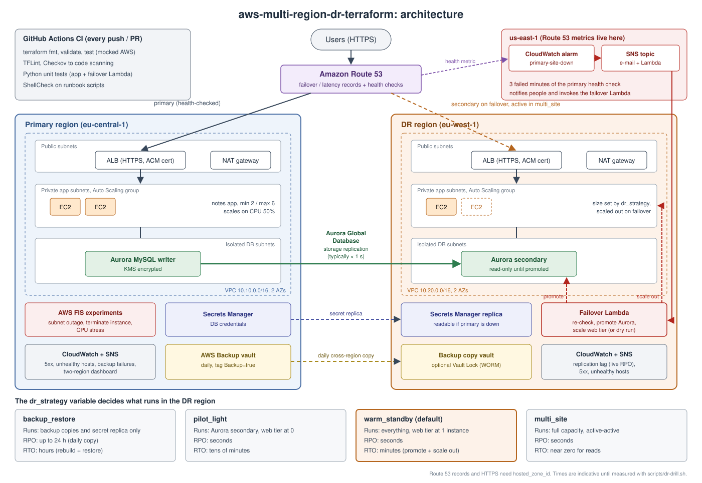

# aws-multi-region-dr-terraform

[](https://github.com/<your-github-user>/aws-multi-region-dr-terraform/actions/workflows/ci.yml)

Terraform project for multi-region disaster recovery on AWS. One variable switches between the four classic DR strategies (backup and restore, pilot light, warm standby, multi-site). The stack includes a database-backed demo application, Route 53 failover, Aurora Global Database, AWS Backup with cross-region copies, monitoring and alerting, an automated failover Lambda, chaos experiments with AWS Fault Injection Service, and a CI pipeline that tests all of it.



---

## 1. What this project is

### The problem

Every production system eventually meets a disaster: a region-wide outage, a corrupted database, a deleted resource, ransomware, or a deployment that breaks everything. Disaster recovery (DR) is the preparation that decides how bad that day becomes. Two numbers frame every DR design. The **recovery point objective (RPO)** is how much data the business can afford to lose, and it depends on how often data is copied somewhere safe. The **recovery time objective (RTO)** is how long the business can afford to be down, and it depends on how much of the system is already running somewhere else.

Lower RPO and RTO cost more money. AWS describes four strategies along that curve, and choosing between them is a business decision as much as a technical one.

### What the project demonstrates

This repository builds the same web application in two AWS regions and lets you move along that cost-versus-recovery curve by changing a single variable, `dr_strategy`. Each strategy deploys exactly the resources it needs, so you can compare them honestly in terms of cost, complexity and recovery time.

The project goes past a diagram-level demo in five ways:

1. **The application stores data.** A small notes service writes to Aurora, so a failover visibly preserves (or loses) real rows. You can prove the RPO, not just claim it.
2. **Failover is automated but controllable.** An alarm detects the outage, and a Lambda function promotes the standby database and scales the standby web tier. With `auto_failover_enabled = false` the Lambda only reports what it would do, which keeps a human in the loop.
3. **The plan is tested.** Chaos experiments in AWS FIS break the primary site on demand, and `scripts/dr-drill.sh` measures the real RTO and RPO and writes a report you can commit as evidence.
4. **The code is tested.** CI runs formatting, validation, plan-level tests of every strategy with mocked AWS providers, linting, a security scan, Python unit tests and ShellCheck on every push.
5. **It follows production practice.** HTTPS, private subnets, Secrets Manager, encrypted remote state, least-privilege IAM and backup vault locking are all built in. The trade-offs that remain are documented rather than hidden (section 9).

### Who it is for

It is written as a learning and portfolio project for cloud, DevOps and platform engineers. It is also a practical starting point for teams that need to show auditors or management a working, measured DR capability on AWS. It was inspired by an AWS certification lecture on disaster recovery strategies, and it turns those concepts into running infrastructure.

---

## 2. Architecture

The diagram above shows the default `warm_standby` layout. Each layer is described below.

### Traffic: Route 53

Users reach the application through a hostname in your Route 53 hosted zone. A Route 53 health check calls `/health` on the primary site every 10 seconds from several locations worldwide. For `pilot_light` and `warm_standby` the record uses **failover routing**: users go to the primary while it is healthy and to the DR region when it is not. For `multi_site` it uses **latency routing** with health checks on both regions, so both regions serve users all the time (active-active). Without a hosted zone the stack still works and you reach each region through its load balancer address.

### Web tier: ALB and Auto Scaling in private subnets

Each region has an Application Load Balancer in public subnets that terminates HTTPS with an ACM certificate for that region and redirects HTTP to HTTPS. The EC2 instances run in private subnets with no public IPs and reach the internet only through a NAT gateway. They run Amazon Linux 2023, IMDSv2 only, and encrypted disks, and you access them through SSM Session Manager instead of SSH. An Auto Scaling group keeps the right number of instances alive and scales on CPU. The DR group's size is set by the chosen strategy.

The design uses two health checks on purpose. The load balancer uses `/health/live`, which only checks that the process is up, so a database outage does not make Auto Scaling terminate healthy instances in a loop. Route 53 uses `/health`, which also checks the database, so a dead database does trigger regional failover.

### Application: a notes service that proves data survives

`app/app.py` is a small Python web service built on the standard library and PyMySQL. It shows which region, instance and availability zone answered, whether that region's database is writable, and the latest notes. It exposes a JSON API (`/api/whoami`, `/api/notes`, `/api/notes/<id>`) that the DR drill uses to write a marker note before the outage and check for it afterwards. While the DR database is still a read-only replica, writes return a clear `503 read-only` error. After promotion, the same database endpoint becomes writable and the app needs no reconfiguration.

### Data: Aurora Global Database

The primary region runs the Aurora MySQL writer. The DR region runs a read-only secondary cluster that receives changes through Aurora's storage-level replication, which typically lags by under a second. That lag is your live RPO for every strategy except backup and restore, and it is monitored by an alarm. Both clusters are encrypted with a customer-managed KMS key in their own region and sit in isolated database subnets with no route to the internet. In `multi_site`, **global write forwarding** lets the DR application accept writes, which Aurora forwards to the primary writer.

### Secrets: Secrets Manager with a cross-region replica

The database credentials are generated by Terraform and stored in Secrets Manager, with a replica in the DR region. Each instance reads the copy in its own region at boot, so the DR site can start even when the primary region is completely unavailable.

### Backup: AWS Backup with cross-region copies and Vault Lock

Replication protects against losing a region, but it faithfully copies mistakes too: a dropped table disappears from the DR region within a second. AWS Backup therefore takes a daily backup of everything tagged `Backup=true` under every strategy, copies it to a vault in the DR region, and can lock that vault with Vault Lock (write once, read many). An EventBridge rule sends an alert when a backup or copy job fails, because a backup that silently stops working turns a 24-hour RPO into weeks.

### Monitoring and alerting

CloudWatch alarms cover the primary site health check, Aurora replication lag, load balancer and application 5xx errors, and unhealthy instances in each region. They publish to SNS topics that can e-mail you. A single CloudWatch dashboard shows both regions side by side: health, request volume, errors and replication lag. One detail matters here: Route 53 health check metrics exist only in `us-east-1`, so the outage alarm and its SNS topic live there regardless of your regions.

### Automated failover

When the primary health check has failed for three consecutive minutes, the alarm in `us-east-1` publishes to SNS, which invokes the failover Lambda in the DR region. The Lambda then:

1. Re-checks the health check, so a brief blip that has already recovered does not trigger a failover.
2. Promotes the Aurora secondary with `failover-global-cluster`, accepting the loss of any unreplicated writes because the primary is assumed unreachable.
3. Raises the DR Auto Scaling group to production size.
4. Reports what it did.

Every step is idempotent, so a repeated alarm cannot cause a second failover. With `auto_failover_enabled = false`, the default, it sends a "manual failover needed" notification describing what it would have done instead. The Lambda is deployed in the DR region because it must keep working when the primary region is the one that failed.

### Chaos engineering

Three AWS FIS experiment templates are created, and they cost nothing until started:

| Template | What it does | What it proves |
|---|---|---|
| Primary outage | Blocks all network traffic in the primary web-tier subnets for 10 minutes | Detection, alarm, automated or manual failover, DNS switch, data survival |
| Terminate instance | Terminates one primary web instance | Auto Scaling self-healing with no user-visible errors |
| CPU stress | Five minutes of CPU load on every primary instance | Target-tracking scale-out and scale-in |

### State and delivery

Terraform state lives in an encrypted, versioned S3 bucket with native S3 locking. The `bootstrap/` stack creates that bucket and defaults it to the **DR region**, so you can still run Terraform when the primary region is down. GitHub Actions runs the quality gates described in section 7.

---

## 3. Disaster recovery strategies

| `dr_strategy` | Running in the DR region | Route 53 routing | Indicative RPO | Indicative RTO | Relative cost |
|---|---|---|---|---|---|
| `backup_restore` | VPC, backup copy vault, secret replica | Simple record to primary | Up to 24 h | Hours: rebuild with Terraform and restore | Lowest |
| `pilot_light` | Aurora secondary; ALB and Auto Scaling group at 0 instances | Failover | Seconds | Tens of minutes: promote, boot instances | Low to medium |
| `warm_standby` (default) | Everything, web tier at 1 instance | Failover | Seconds | Minutes: promote, scale out | Medium |
| `multi_site` | Everything at production size, write forwarding on | Latency (active-active) | Seconds | Near zero for reads; writes need promotion | Highest |

The RPO and RTO values are indicative until you measure them in your own account with `scripts/dr-drill.sh` (section 7). Record your measured values here once you have them:

| Strategy | Measured traffic RTO | Measured write RTO | Measured RPO | Drill report |
|---|---|---|---|---|
| warm_standby | not yet measured | not yet measured | not yet measured | `drill-results/` |

---

## 4. What a failover looks like

For `warm_standby` with automation enabled, the timeline after the primary site goes down is roughly:

| Approximate time | Event |
|---|---|
| 0 | Primary web tier stops answering |
| ~30 s | Route 53 marks the primary unhealthy (3 failures at 10 s intervals) and starts answering DNS queries with the DR load balancer. Users whose DNS cache has expired reach the DR site, which serves reads immediately. |
| ~3–4 min | The `primary-site-down` alarm fires and the failover Lambda runs |
| a few minutes more | Aurora finishes promoting the DR cluster; writes succeed in the DR region. The DR Auto Scaling group grows to production size. |

These are design estimates; your drill report gives the real numbers. Under `pilot_light` the DR site first has to boot its instances, so reads also wait for them. Under `multi_site` the DR site is already serving users at full size, so only writes wait for promotion.

The step-by-step procedures for manual failover, backup restore, failback and post-incident reconciliation are in **[docs/runbook.md](docs/runbook.md)**.

---

## 5. Repository layout

```
aws-multi-region-dr-terraform/
├── .github/workflows/ci.yml     CI: fmt, validate, terraform test, TFLint, Checkov, Python tests, ShellCheck
├── bootstrap/                   One-time stack: encrypted, versioned S3 bucket for remote state
├── app/app.py                   Demo notes service (Python, PyMySQL)
├── lambda/failover/handler.py   Automated failover logic
├── modules/
│   ├── network/                 VPC with public, private app and isolated DB subnets, NAT gateway
│   └── app/                     ALB (HTTP/HTTPS), IAM, launch template, Auto Scaling, alarms
├── versions.tf, backend.tf, providers.tf, variables.tf, locals.tf
├── main.tf                      Networks and web tiers in both regions
├── database.tf                  Aurora Global Database
├── secrets.tf                   Secrets Manager secret with DR replica
├── tls.tf                       ACM certificates and DNS validation
├── dns.tf                       Health checks and routing per strategy
├── backup.tf                    AWS Backup plan, vaults, cross-region copy, Vault Lock, failure alerts
├── monitoring.tf                SNS topics, alarms, two-region dashboard
├── automation.tf                Failover Lambda and its cross-region trigger
├── chaos.tf                     AWS FIS experiment templates
├── outputs.tf
├── scripts/
│   ├── failover.sh              Manual planned switchover or unplanned failover
│   └── dr-drill.sh              End-to-end drill that measures RTO and RPO
├── tests/
│   ├── strategies.tftest.hcl    Plan-level tests of every strategy with mocked AWS
│   └── python/                  Unit tests for the app and the failover Lambda
├── docs/
│   ├── runbook.md               Operating procedures
│   └── testing.md               How each quality gate and drill works
├── diagrams/architecture.svg    Architecture diagram (PNG copy alongside)
└── drill-results/               Commit drill reports here as evidence
```

---

## 6. Getting started

### Prerequisites

You need Terraform 1.10 or newer, the AWS CLI v2, Python 3, `curl`, and an AWS account where you can create VPC, EC2, ELB, RDS, KMS, IAM, Secrets Manager, AWS Backup, CloudWatch, SNS, Lambda, FIS and Route 53 resources. For HTTPS and DNS failover you also need a public Route 53 hosted zone. The stack deploys without one, but you then test through load balancer addresses and the drill script cannot run.

Check that your Aurora engine version supports Global Database in both regions, since available versions change over time:

```bash
aws rds describe-db-engine-versions --engine aurora-mysql --region eu-central-1 \
  --query "DBEngineVersions[?SupportsGlobalDatabases].EngineVersion"
```

### Step 1: create the state bucket (once)

```bash
terraform -chdir=bootstrap init
terraform -chdir=bootstrap apply
terraform -chdir=bootstrap output -raw backend_config > backend.hcl
```

### Step 2: configure

```bash
cp terraform.tfvars.example terraform.tfvars
```

Set at least `dr_strategy`, and ideally `hosted_zone_id`, `domain_name` and `alert_email`. Leave `auto_failover_enabled = false` until you have run a drill and trust the automation.

### Step 3: deploy

```bash
terraform init -backend-config=backend.hcl
terraform plan -out=tfplan
terraform apply tfplan
```

The first apply takes roughly 25–40 minutes, mostly because Aurora creates the primary cluster before attaching the secondary. If you set `alert_email`, confirm the three SNS subscription e-mails (one per region topic).

### Step 4: verify

```bash
curl -s "$(terraform output -raw app_url)/api/whoami"
curl -s -X POST -H 'Content-Type: application/json' \
  -d '{"text":"hello from the primary"}' "$(terraform output -raw app_url)/api/notes"
```

Open `terraform output -raw app_url` in a browser to see the page, and `terraform output -raw dashboard_url` for the dashboard. Then run your first drill (section 7).

### Changing strategy

Edit `dr_strategy` and apply again. Moving from `backup_restore` to a replicated strategy adds the Aurora secondary without touching the primary, because the primary is created inside a global cluster from the start. If a change switches the Route 53 routing type (for example from failover to latency) and Route 53 rejects the transition, run the apply a second time.

### Configuration reference

| Variable | Default | Purpose |
|---|---|---|
| `project_name` | `dr-demo` | Prefix for all resource names |
| `primary_region` / `dr_region` | `eu-central-1` / `eu-west-1` | The two regions |
| `dr_strategy` | `warm_standby` | `backup_restore`, `pilot_light`, `warm_standby` or `multi_site` |
| `dr_activate` | `false` | Keep the DR web tier at production size (set after a failover) |
| `auto_failover_enabled` | `false` | Let the Lambda fail over by itself instead of only notifying |
| `primary_capacity` | `{min=2, desired=2, max=6}` | Primary web tier size; also the DR size when activated |
| `instance_type` | `t3.micro` | Web tier instance type |
| `db_engine_version` | `8.0.mysql_aurora.3.08.0` | Aurora MySQL version (must support Global Database) |
| `db_instance_class` | `db.r6g.large` | Aurora instance class (burstable classes are not supported) |
| `db_instances_per_region` | `1` | Use 2 for Multi-AZ inside each region |
| `hosted_zone_id` / `domain_name` | `null` | Enable DNS failover and HTTPS |
| `health_check_interval` | `10` | Route 53 check interval, 10 or 30 seconds |
| `alert_email` | `null` | E-mail for alarm notifications |
| `replication_lag_alarm_ms` | `2000` | Replication lag alarm threshold |
| `backup_schedule` | daily 03:00 UTC | AWS Backup schedule |
| `backup_retention_days` / `dr_copy_retention_days` | `35` / `35` | Retention in each vault |
| `enable_vault_lock` | `false` | Vault Lock (governance mode) on the DR vault |
| `enable_chaos_experiments` | `true` | Create FIS experiment templates |
| `db_deletion_protection` / `alb_deletion_protection` | `false` | Turn on for anything real |

---

## 7. Testing and quality gates

Details are in **[docs/testing.md](docs/testing.md)**. In summary:

| Layer | Tool | Needs AWS? |
|---|---|---|
| Formatting and syntax | `terraform fmt`, `terraform validate` | No |
| Strategy wiring (7 scenarios) | `terraform test` with mocked providers | No |
| Terraform best practice and invalid values | TFLint with the AWS ruleset | No |
| Security misconfiguration | Checkov, results in GitHub code scanning | No |
| App and failover logic (17 tests) | Python `unittest` with fakes | No |
| Scripts | ShellCheck | No |
| Self-healing, scaling, regional failover | AWS FIS experiments | Yes |
| Measured RTO and RPO | `scripts/dr-drill.sh` | Yes |

The first six gates run in CI on every push. The last two run in your account and produce the evidence that the design works.

---

## 8. Security

HTTPS is enforced whenever a domain is configured, with a TLS 1.2+/1.3 policy. Web instances have no public IPs, accept traffic only from their load balancer, use IMDSv2 only and encrypted disks, and are reached through Session Manager rather than SSH. The database sits in subnets without internet routes, accepts connections only from the web tier and is encrypted with customer-managed KMS keys. Credentials live in Secrets Manager, and each instance's IAM role can read only that one secret. The failover Lambda can scale only the DR Auto Scaling group and read only the primary health check. The default security group of each VPC is emptied. Terraform state is encrypted, versioned and accessible only over TLS.

Known trade-offs are listed with reasons in `.checkov.yaml`. The most important ones follow.

**Password in state.** The database password is generated by Terraform and therefore appears in the state file. The encrypted remote backend mitigates this; write-only attributes in newer provider versions could remove it.

**No password rotation.** Rotation is not enabled, because Terraform owns the Global Database password.

**Development defaults.** Deletion protection is off and backup vaults use `force_destroy` by default so the demo can be destroyed cleanly. Turn both on for production.

**Omitted logging.** ALB access logs and VPC flow logs are not enabled, to keep the demo cheap.

---

## 9. Cost

Aurora is the largest cost. Global Database requires memory-optimized instance classes, and every replicated strategy runs at least one database instance in each region around the clock, plus replicated write I/O. NAT gateways (one per region with running instances), load balancers and fast Route 53 health checks follow. `backup_restore` is by far the cheapest, since the DR region holds only stored backups, while `multi_site` roughly doubles the production bill. That spread is exactly the trade-off the strategies exist to express. Price your regions in the AWS Pricing Calculator before leaving the stack running, and destroy it after experiments.

---

## 10. Limitations and future work

**Not yet deployed or run by the author.** This version was written and checked statically: Python tests pass and the Terraform structure was cross-checked. It has not yet been planned, applied or drilled in a real account. The first CI run and the first drill are the real proof. Expect small fixes, for example an engine version that is unavailable in your region, or a TFLint or Checkov finding to triage.

**State drift after a real failover.** After an unplanned failover, the database roles no longer match the Terraform configuration. The runbook describes how to reconcile, but that step is manual.

**Single NAT gateway per region.** The web tier depends on one AZ for outbound access at boot. Production would use one NAT gateway per AZ, or VPC endpoints plus a pre-baked AMI.

**Instances install packages at boot.** A golden AMI built with Packer would boot faster and shorten the pilot light RTO.

**Stateful application pieces.** The application has no sessions or file uploads. A real application would also need to replicate those (for example DynamoDB global tables, or S3 cross-region replication).

**Possible next steps.** Add Terratest for real apply-and-destroy tests in a sandbox account, schedule monthly drills from CI, and add a failback automation.

---

## 11. Clean up

```bash
terraform destroy
terraform -chdir=bootstrap destroy   # only when you no longer need the state bucket; empty it first
```

Destroying the Aurora global cluster takes a while because the secondary must be detached first, and Terraform handles the ordering. KMS keys are scheduled for deletion after 7 days.
