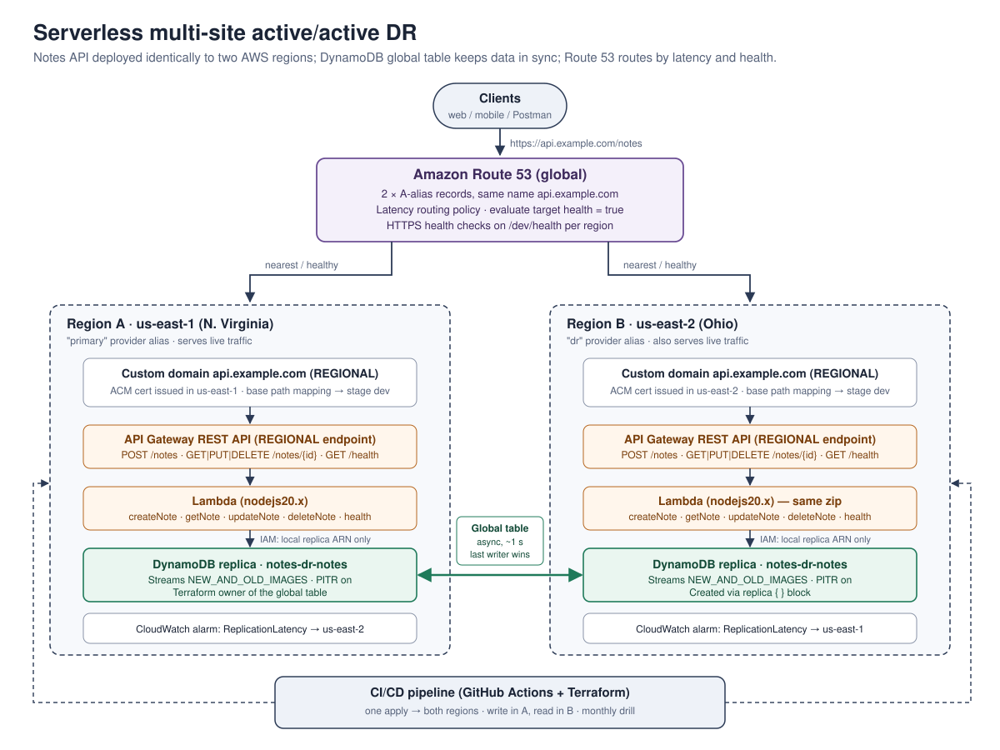

# Serverless multi-site active/active DR — Terraform edition

A Terraform re-implementation of the demo *"Building a disaster recovery strategy for serverless applications". 



## The scenario in short

A note-taking REST API (create, read, update, delete notes) must survive the loss of an entire AWS region. The serverless services are already highly available *inside* a region (multi-AZ), but regions themselves occasionally go down for hours, so the question to ask is whether your customer can tolerate that downtime.

The chosen strategy is **multi-site active/active**. The complete stack — API Gateway, Lambda and a DynamoDB replica — runs in two regions at the same time (us-east-1 and us-east-2) and both serve real traffic. A DynamoDB **global table** replicates every write to the other region in roughly a second. Route 53 publishes one hostname, `api.example.com`, with latency-based alias records pointing at each region; when a region becomes unhealthy, Route 53 stops returning it and all users land on the surviving region. RTO is close to zero and RPO is roughly the replication lag.

This is affordable for serverless because you pay per request rather than for uptime: an idle second region costs almost nothing. That is also why, for serverless, pilot light, warm standby and active/active largely merge — there is little reason to keep serverless resources switched off.

## DR strategies at a glance

| Strategy | What runs in the DR region | Typical RTO / RPO | Cost |
|---|---|---|---|
| Backup & restore | Nothing; restore from backups after the disaster | hours | lowest |
| Pilot light | Data replicated live; compute provisioned/started on failover | tens of minutes | low |
| Warm standby | Full stack, scaled down; scale up on failover | minutes | medium |
| **Multi-site active/active** (this repo) | Full stack, taking live traffic | ~zero | highest for servers, low for pure serverless |

RTO (recovery time objective) is how long you can be down; RPO (recovery point objective) is how much data you can afford to lose.

## Terraform project

| Serverless Framework / console | This project |
|---|---|
| Separate `infra` service holding the `AWS::DynamoDB::GlobalTable`, deployed once | `modules/dynamodb-global-table`, instantiated once with the primary provider and a `replica` block for the DR region |
| DynamoDB Streams with new and old images (required for replication) | `stream_enabled = true`, `stream_view_type = "NEW_AND_OLD_IMAGES"` |
| `notes` service deployed with `--region us-east-1` and `--region us-east-2` | `modules/regional-api` instantiated twice (`module.api_primary`, `module.api_dr`) with `aws.primary` / `aws.dr` provider aliases |
| `TABLE_NAME` env var + IAM ARN built from region and account | Same: `TABLE_NAME` env var, IAM policy scoped to `arn:aws:dynamodb:<region>:<account>:table/<name>` (local replica only) |
| Lambda stamps `process.env.AWS_REGION` on each note | `src/notes.mjs` writes `region`, and also returns an `X-Served-By-Region` header |
| `endpointType: REGIONAL` so no hidden CloudFront distribution | `endpoint_configuration { types = ["REGIONAL"] }` on the REST API and on the custom domain |
| ACM certificate (apex + wildcard) requested in each region | `aws_acm_certificate` per region, DNS-validated; `allow_overwrite` because both regions share the validation CNAME |
| API Gateway custom domain + API mapping, repeated in both regions | `aws_api_gateway_domain_name` + `aws_api_gateway_base_path_mapping` inside the regional module |
| Two Route 53 alias A records, same name, latency policy, "evaluate target health" | `aws_route53_record.api_latency` (for_each over regions) with `evaluate_target_health = true` |
| Deploy via pipeline to primary, then DR | `.github/workflows/deploy.yml` — one apply updates both regions, then runs the smoke test |
| Replication lag metric + CloudWatch alarm | `monitoring.tf` — `ReplicationLatency` alarms in both directions |
| Active/active doesn't stop data corruption → keep backups | Point-in-time recovery enabled on every replica |

Two additions. First, a `/health` endpoint plus Route 53 HTTPS health checks: an alias record's "evaluate target health" only notices when the API Gateway service itself is impaired, while the health check exercises Lambda *and* the local DynamoDB replica. Second, a `simulate_primary_failure` switch that inverts the primary health check, which gives you a safe, repeatable failover drill (recommends a full failover exercise every month).

## Project layout

```
.
├── versions.tf / providers.tf     # two provider aliases: primary + dr
├── variables.tf / locals.tf
├── main.tf                        # global table (once) + regional API (twice)
├── dns.tf                         # Route 53 latency records + health checks
├── monitoring.tf                  # replication latency alarms
├── outputs.tf
├── backend.tf                     # example S3 backend (keep state out of the primary region)
├── modules/
│   ├── dynamodb-global-table/     # table + replica, streams, PITR
│   └── regional-api/              # IAM, Lambda x5, REST API, ACM, custom domain
├── src/notes.mjs                  # Lambda handlers (AWS SDK v3, no dependencies)
├── scripts/
│   ├── smoke-test.sh              # write in A, read in B, read via custom domain
│   └── failover-drill.sh          # force traffic to the DR region and back
├── docs/
│   ├── architecture.svg
│   └── RUNBOOK.md
└── .github/workflows/deploy.yml
```

## Deploying

You need Terraform 1.5+, AWS credentials allowed to manage the resources above in both regions, and an existing public Route 53 hosted zone. `jq` and `curl` are used by the scripts.

```bash
cp terraform.tfvars.example terraform.tfvars   # set hosted_zone_name
terraform init
terraform plan
terraform apply          # ACM DNS validation can take a few minutes
./scripts/smoke-test.sh
```

Then try it by hand:

```bash
API=$(terraform output -raw api_url)
curl -s -X POST "$API/notes" -H 'Content-Type: application/json' \
     -d '{"title":"first note","content":"hello"}'
curl -s "$API/notes/<id>"
```

Writing through `primary_invoke_url` and reading through `dr_invoke_url` reproduces the demo's check that a note created in one region shows up in the other with the originating region recorded on it.

## Things the design deliberately accepts

**Write conflicts.** Two users updating the same item in different regions at nearly the same moment is resolved by DynamoDB global tables as *last writer wins*. That is fine for notes. For something like booking the last seat on a flight, route writes for a given entity to one "home" region or use a strongly consistent single-writer design.

**Replication lag and the CAP theorem.** With data partitioned across regions you must choose between consistency and availability; DynamoDB global tables choose availability, so cross-region reads are eventually consistent (typically around a second, longer during regional trouble). The alarm in `monitoring.tf` tells you when lag grows.

**Corruption replicates too.** A bad deploy or a bad query is copied to every region within a second. Active/active is not a backup; point-in-time recovery is, and restores should be tested regularly.

**Terraform during an outage.** This configuration manages both regions in one state. During a real outage of the primary region you normally do not need to run Terraform at all — Route 53 fails over on its own. If you must, the primary provider calls will fail; use `-target` on DR resources or split the regional stacks into separate state files. Keep the state bucket outside the primary region (see `backend.tf`).

## Cost notes

API Gateway, Lambda and DynamoDB on-demand cost nothing while idle, so the second region adds very little. The fixed costs are Route 53 health checks (a few dollars per month for two HTTPS checks), replicated write request units for the global table, and extra storage for the replica and PITR.

## The real-world scenario (not implemented here)

A multi-tenant SaaS quality management system with an RTO of six hours and an RPO of one hour. Because it mixes serverless with containers (Fargate, App Runner), ElastiCache and third-party services, the team chose **pilot light** between eu-west-1 and eu-central-1: CloudFront, API Gateway and Lambda are pre-deployed in the DR region (free while idle), MongoDB Atlas multi-region replication and S3 cross-region replication keep the data live, ElastiCache uses a global datastore, containers sit at desired count zero, all configuration lives in SSM Parameter Store, Cognito users are re-created on first login through a migrate-user Lambda trigger, and a CloudFront origin failover page tells users recovery is in progress. Scaling up is scripted and documented in a runbook. This repository implements only the first, simpler active/active demo; `docs/RUNBOOK.md` borrows the runbook-and-drill discipline from that second scenario.
